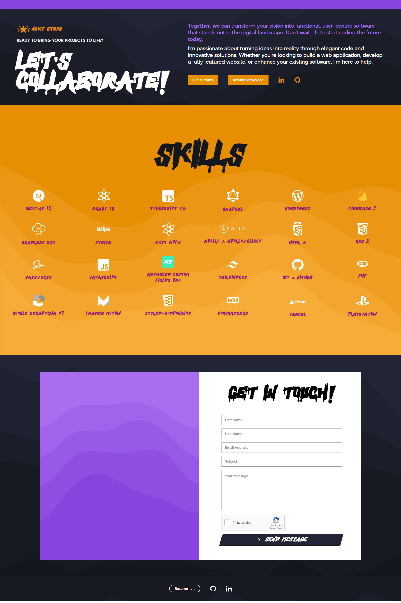
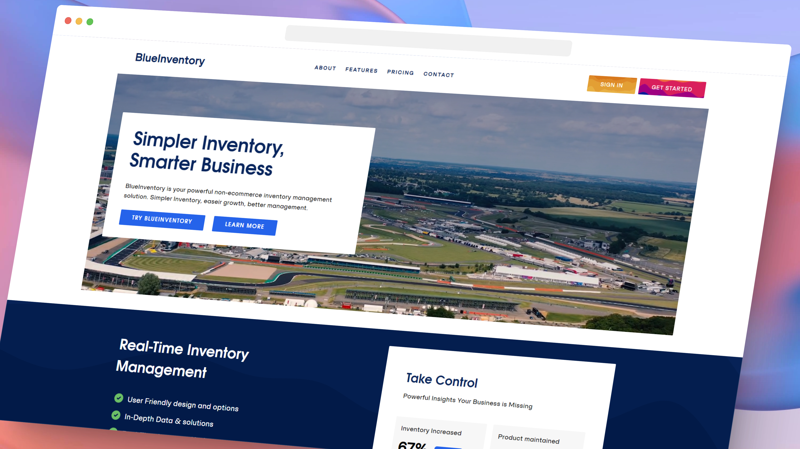
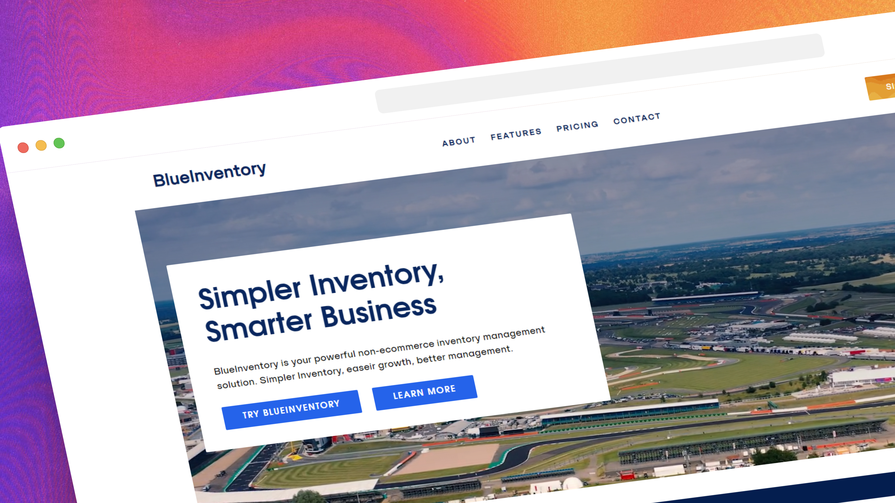
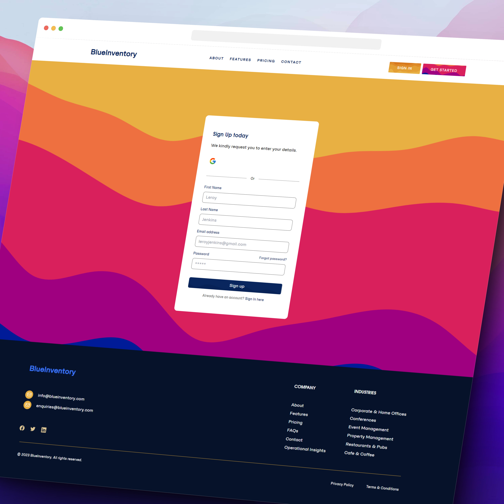
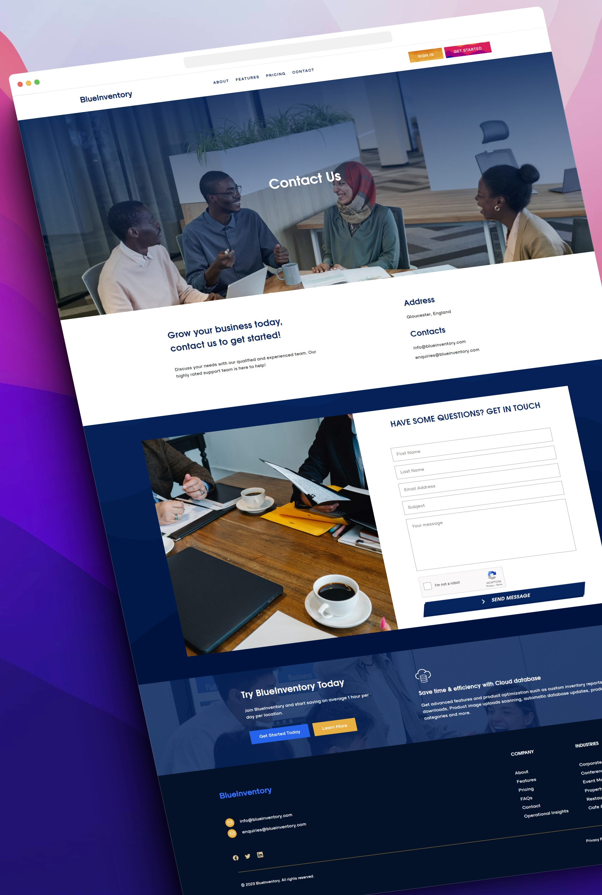
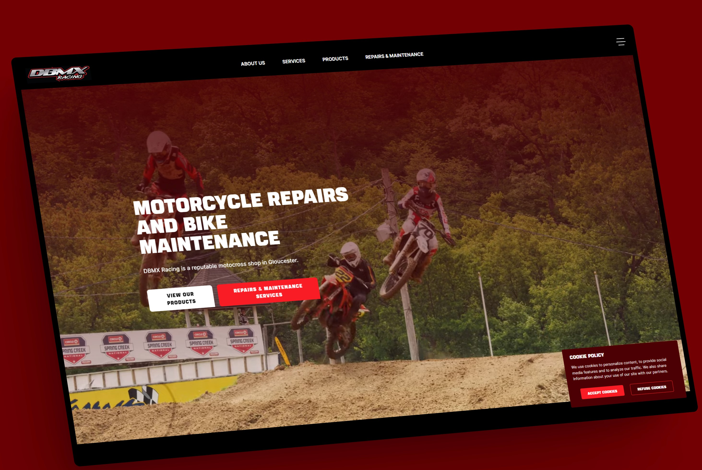
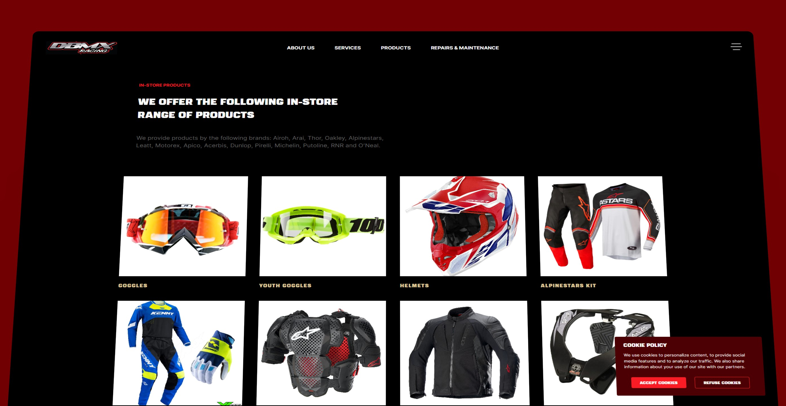
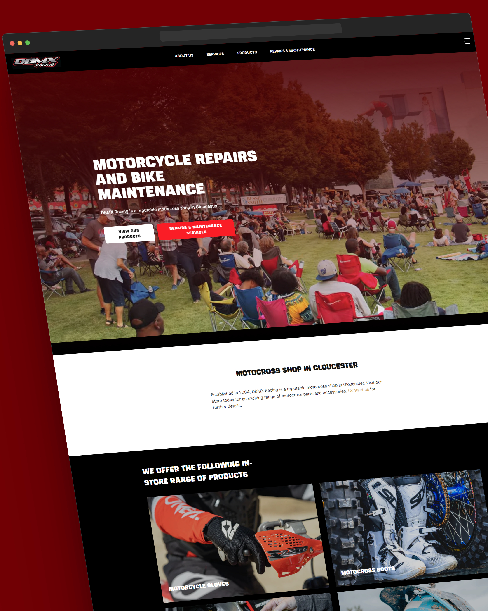
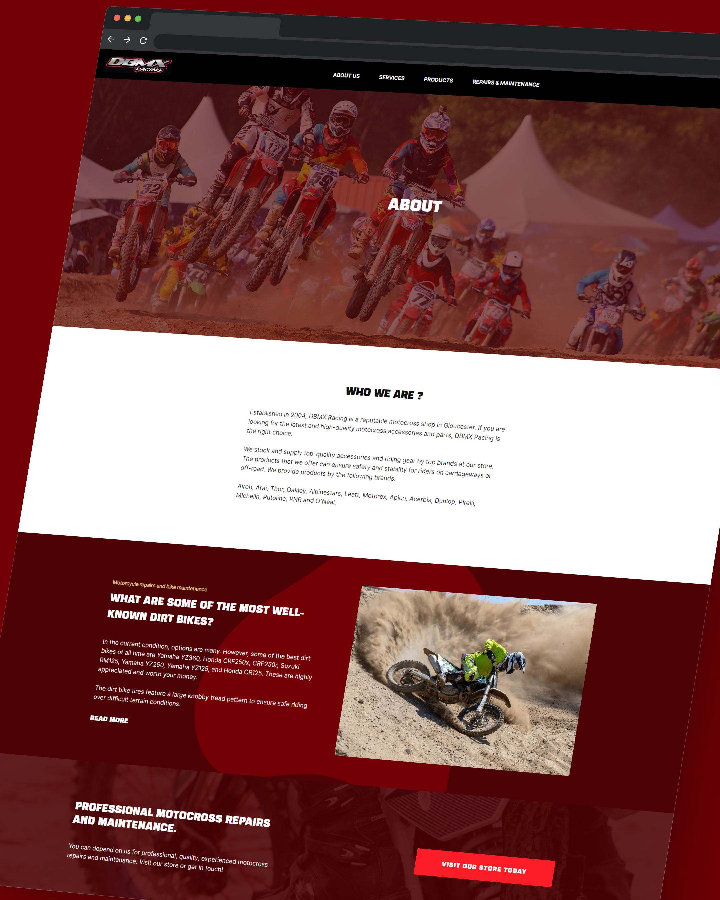

# Portfolio Intro
My Developer Portfolio. Containing all my live project for display. All images are in 4K resolution, click to enlarge for better viewing.

| | | |
|:-------------------------:|:-------------------------:|:-------------------------:|
|   |   |  |

# My Objective
The purpose of my front-end developer portfolio is to showcase my journey, expertise, and achievements in the realm of web & software development. Through a curated collection of projects, I aim to demonstrate my proficiency in various programming languages, frameworks, and technologies. By highlighting the challenges I've tackled and the solutions I've devised, I hope to underline my problem-solving skills and commitment to continuous improvement.

Ultimately, my portfolio serves as a testament to my abilities and stands as an open invitation for collaboration, discussion, and the exploration of new opportunities in the ever-evolving field of software development.

# Portfolio Context

1.) I wanted to be able to create a website to showcase my skills. The primary forcus/purpose of my portfolio is to show a normal person (Not Developer) the depth of my technical skills. It showcases my proficiency in the programming languages, frameworks, tools, and technologies relevant to me.

All my projects showcased are real-world projects, I have worked to optimize the clients websites, Enhance & intergrate functionality, Improved performance and to deliver an exceptional browsing experience for their users. To future proof and implement up-to-date SEO strategies to attract more organic traffic.

# Deployment

Deployed with vercel here: 

https://toddowenmpeli.vercel.app

# BlueInventory Project

1. Live Link: https://blueinventory.vercel.app/
2. Github Link: https://github.com/Todd-Owen-Mpeli/blueinventory
3. More Info: https://toddowenmpeli.vercel.app/projects/blueinventory

| | |
|:-------------------------:|:-------------------------:|
  | One | Two |
|   |   |
| | |
| Three | Four |
|   |   |

# DBMX-Racing Project

1. Live Link: https://dbmx-racing.vercel.app
2. Github Link: https://github.com/Todd-Owen-Mpeli/DBMX-Racing
3. More Info: https://toddowenmpeli.vercel.app/projects/DBMXRacing

| | |
|:-------------------------:|:-------------------------:|
  | One | Two |
|   |   |
| | |
| Three | Four |
|   |   |

# MponjoliMpeli Apartment Project

1. Live Link: https://mponjolimpeliapartments.vercel.app
2. Github Link: https://github.com/Todd-Owen-Mpeli/MponjoliMpeli-Apartments
3. More Info: https://toddowenmpeli.vercel.app/projects/MponjoliMpeli-Apartments

| | |
|:-------------------------:|:-------------------------:|
  | One | Two |
|   |   |
| | |
| Three | Four |
|   |   |

# Image Gallery

